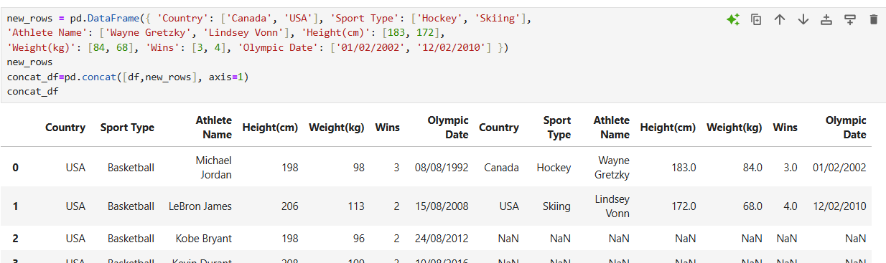

# dataScience-Lec9-02-APR-25-
GROUP BY presentation 22 start from page 4
* df.ffill()- forword fill()
* df.bfill()- backwords fill()
* df.groupby(<label>,group_keys=False)- return generic structure - not easy to work with, need to convert to some struction
  * template: groupby(column name).<column to do the action>.<what action to do-function>(numeric_only=True- do the action only on numbers)
  * group_keys= optional parameter:
    * prevents pandas from adding these group labels to the result.
    * the default is True
  * df.groupby('model_year')[weight].mean()=the index is model year value and the values :
    *  for each model_year return the result calculation of mean on all weight
    * in a list :df.groupby('model_year')[weight].mean()
    * in a df: df.groupby('model_year')[[weight]].mean()
    * in a df: df.groupby('model_year')[[weight],'mpg']].mean()= will do for each model_year mean for weight and mean for mpg
  * df.groupby('model_year')[weight].value_counts()- for each year count each weight
  * df.groupby('model_year').value_counts()- for each group do the action value_count for each column
  * df.groupby('model_year').agg({})- page 11: to make different action on different columns 
    * df.groupby('model_year').agg({'weight':'max'/['max','min'],mpg:'mean'}).rename(columns={weight:max_weight,mpg=mean_mpg})- 
    * better to do rename on the columns- to the results of the actions in the agg
    * if there are Nan after the action like std, in multiGroups, it's becuase in that multiGroup there was a missing value:
      * better to fill the data in that column: 
      ```
      height_wins_stat[('Height(cm)', 'std')]=height_wins_stat[('Height(cm)', 'std')].fillna(0)
      ```
  * groupby makes the element to be the index - if want to make after action, better to reset_index()
  * df.groupby('model_year')['horsepower'].nlargest(3)= return the top 3 max values and their index number
    * 70 group_year 8 index 225 values
  * group by 2 columns ['model_year', 'cylinder']: multi indexing
    * groupby_year=df.groupy(['model_year', 'cylinder']).value_counts: return for each group, how many have year=70 and cylinder= 4
    * index is a list of tuples: the to access need use tuple:loc[(71,4)]
      * if you do reset index, indexes columns become columns 
    * can return by first index[71]
    * can't return all loc[(:4)]- by second index
      * therefore use: cross_Section: xs:  without change the structure
        * groupby_year.xs(level='cylinders',key =4)
        * if want by 2 value cylinders 6,8:
          * or filter by cylinders and the groupby
            * 
          * or swaplevel to 4,70 and the loc[4]
            * df.swaplevel vs xs: swaplevel more expensive and not ideal
              * then you can sort_index(level=['cylinder','model_year'])
    * include_group - optional parameter: when combine groupby and apply
      * controls whether the grouping column(s) should be included in the df passed to the function inside .apply().
      * better to add it to avoid error of deprecate:
        * "DeprecationWarning: DataFrameGroupBy.apply operated on the grouping columns."
        * or to avoid the error of deprecate, set_index first on the groupby label, do the action and in the end reset index back:
          * example - get max 2 height, group by 'sport_type':
            * df.set_index('Sport Type').groupby('Sport Type', group_keys=False).apply(lambda x: x.nlargest(2, 'Height(cm)')) .reset_index()
    * level - optional parameter: to used to specify which level(s) of a MultiIndex to group by, level=<label name>
      * if you’re using a regular index, level=0 just means "group by the index." 
  * concat - by row/by column
    * concat_df=pd.concat([df,new_rows],axis=0)) will add the new_rows at the end of the df
      * to reset index:add after .reset_index(drop=True):
        * the drop parameter will delete the new column name index(contain the origin indexes before the reset)
      *   axis=0 by default, if you want to concat by columns  axis=1, it means to add to the exist rows new columns:
        * must be with the same indexes
        * maybe the exact same column names:
      
  * merge(df1,df2,left_on=label,right_on=label,suffixes/how)
    * example: (login, register, on='user_id', how='inner',suffixes=('_login', '_register')
    * on parameter: the same parameter, otherwise **left_on,right_on** parameters
    * suffixes =  merge df and add suffixes on duplicate columns
    * how= default=inner join, options:'inner','left','right', 'cross','outer'
    * 
  * str methods: .str.<str function> 
    * works on values/ columns
    * to replace apply with cb function
  * time methods: pd.to_datetime(df['DATE']):
    * works good with groupby, to get all groups by month from the full date
    * format='dd-mm-yyyy'
    * resample(rule='A')- create group by rule A= like create group by month/day/year and then continue with groupby actions